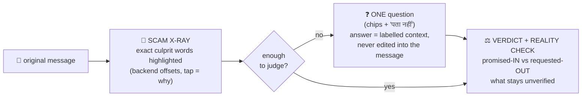
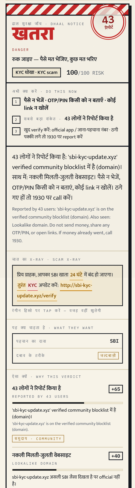
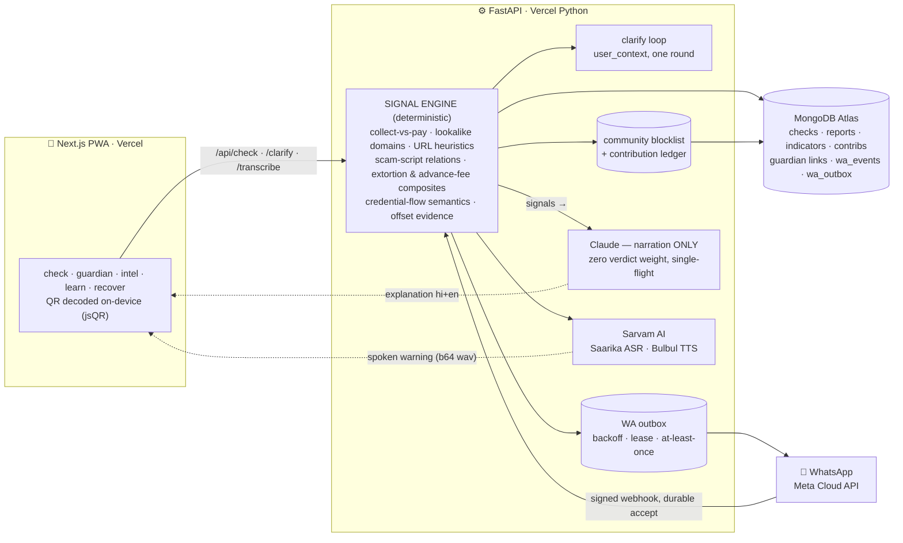

<div align="center">


# ढाल **Dhaal**

### पैसे भेजने से पहले — एक जाँच। · *Before you pay — one check.*

**The pre-payment scam shield for every Indian with a phone.**
Paste any message, link, UPI ID, or QR photo — or just **speak** — and Dhaal shows you, in your own language, **exactly which words** smell like fraud, asks **one smart question** when it isn't sure, and confronts the payment's **promise vs reality** — all **before** you authorise anything. Every confirmed report strengthens everyone else's shield.

<br/>

[**🛡️ LIVE APP**](https://dhaal-delta.vercel.app) · [**API**](https://dhaal-api.vercel.app/api/health) · [Demo run-sheet](demo/RUNSHEET.md) · [Honest eval](docs/EVAL.md) · [Engineering handoff](docs/HANDOFF-H16.md)


*Built overnight at **MUJ HackX 4.0** — Manipal University Jaipur, Sep 11–12 2026 · Fintech PS#7: Consumer Protection Against Payment Scams*

</div>

---

| The poster, not a SaaS dashboard | The war room, live from the community |
|:--:|:--:|
|  |  |

---

## Contents

[The problem](#the-problem) · [What Dhaal does](#what-dhaal-does) · [The connected workflow](#the-connected-workflow--x-ray--one-question--reality-check) · [Why the verdict can be trusted](#why-the-verdict-can-be-trusted) · [Architecture](#architecture) · [The signal engine](#the-signal-engine) · [Honest evaluation](#honest-evaluation--we-publish-our-misses) · [Reliable under failure](#reliable-under-failure) · [The community flywheel](#the-community-flywheel) · [Voice, both directions](#voice-both-directions) · [Measured performance](#measured-performance) · [API](#api) · [Run locally](#run-locally) · [Tests](#tests) · [Roadmap](#roadmap) · [Team](#team)

---

## The problem

India runs on UPI — **23.2 billion transactions in May 2026 alone** (NPCI). And the fastest-growing fraud doesn't hack anything: the fake KYC link, the ₹15,000 "refund" that's actually a collect request, the "digital arrest" phone call. In each one, **the victim authorises the payment themselves** — which is why bank-side fraud controls structurally cannot stop it. **₹22,000+ crore** was lost to cyber fraud in 2025; UPI fraud alone crossed **₹805 crore in FY26** across 10.64 lakh reported incidents.

The defence has to live where the decision happens: **in the user's hand, at the moment before they pay, in the language they think in.** That's Dhaal.

## What Dhaal does

| Surface | What happens |
|---|---|
| 🔍 **जाँच / Check** | Paste text, a link, a UPI ID, a number — upload a **QR photo** (decoded on-device with jsQR; the image never leaves the phone) — or press the mic and **speak**. The engine returns **खतरा · सावधान · कोई ज्ञात खतरा नहीं** with every signal named and weighted, the **Scam X-Ray** highlighting the exact culprit words, **one clarifying question** when the input is genuinely ambiguous, and the **payment reality check** for anything that would open your UPI app. Then Dhaal **speaks the warning aloud**. |
| 💬 **WhatsApp bot** | Forward the scam to Dhaal's number and the verdict lands in the same chat — same engine, same honesty. Needs-context messages get the question first; media gets an honest "photo/QR not supported here yet". Signature-verified webhook, durable inbound dedupe, outbox with retries ([delivery semantics](docs/CHANNELS.md)). *Code complete + 69 stubbed checks; live sends await Meta test-number activation.* |
| 👨‍👩‍👧 **परिवार की ढाल / Guardian** | Pair a parent's phone with a family member's (single-use pairing code, atomic claim, role-scoped capability tokens hashed at rest, revocable both ways). A risky check on the ward's phone pings the guardian for a 10-second **Advise-stop / Allow** with a note — the guardian *advises*, the ward always holds the phone. The guardian sees the risk, never the ward's transactions. |
| 🗺️ **धोखों का नक्शा / Intel** | Anyone can report a scam. A human moderator verifies it. The number/UPI/domain instantly joins the **shared blocklist** that protects every user's next check — tracked in an exactly-once contribution ledger with drift-repair reconciliation. Live war-room board: verified reports, trends by scam type, day, city. |
| 🎓 **अभ्यास / Learn** | A clearly-fictional practice round: spot the requested action and the money direction on synthetic scams, get neutral feedback. Tallies stay on-device; a practice score is never presented as a safety score. ([Usability protocol](docs/USABILITY.md) prepared; human sessions honestly pending.) |
| 🚑 **पहला घंटा / Recover** | Just got scammed? The first hour decides whether money comes back (the 1930 system has recovered ₹3,400+ crore — when people report fast). Dhaal generates the **1930 call script, the cybercrime.gov.in complaint draft, and the bank dispute letter** — personalised, in Hindi, with copy buttons. |

## The connected workflow — X-Ray → one question → reality check

Dhaal's standout is not a card, it's a **sequence** that mirrors how a person actually gets scammed:



<div align="center"></div>

- **🔬 X-Ray is surgically precise.** Evidence comes from the backend with stable ids and **UTF-16 code-unit offsets** (a documented convention that stays exact between Python and JavaScript — Hindi and emoji included; the frontend never re-searches text). Multiple fragments per finding, repeated phrases, and **overlapping findings all survive**; tapping a highlight explains what *that* phrase supports. Extracted numbers/UPI IDs/links are tagged **जानकारी (info)** — identifiers on record, explicitly *not* accusations, ownership explicitly *not* verified.
- **❓ The question is targeted, not chatty.** "OTP आपसे कोई माँग रहा है, या आप खुद app में डाल रहे हैं?" · "पैसे भेजने थे या आने थे?" One round, smallest useful question, chips + free text + *I don't know*. The answer is stored **next to** the message as `user_context` — the card then shows **"आपके जवाब से जाँच बदली"** with before → after. A reassuring answer can never erase direct evidence of a dangerous demand.
- **⚖️ The reality check confronts promise with mechanics.** For any parsed payment request: what you expected, what the code actually opens (pay/collect, amount, payee), **₹5,000 promised IN vs ₹4,999 requested OUT** when a "refund" message carries a pay request, and the honest line: *reading a code moves nothing — authorising does; ownership is not verified here.*

## Why the verdict can be trusted

This is the architectural spine, and it's deliberate:

- **The verdict is computed, never generated.** Deterministic detectors + the community blocklist produce the signals and the score. The LLM **narrates** what was found — it carries **zero verdict weight**, cannot invent a danger, and cannot talk one away. Narration is single-flight, bounded, and a stale response can never overwrite a newer check.
- **Never fabricates.** A failed transcription is a clear error, never a synthetic transcript passed off as the user's words (the retired IVR lane's fixture fallback was **deleted**, not just disabled). A WhatsApp send timeout is documented **at-least-once** delivery — retried honestly, never claimed exactly-once.
- **Fails safe, always.** Every external dependency (Claude, Sarvam, Atlas) degrades to template explanations and an in-memory store. A dead API degrades the prose, never the protection — and degraded storage is *labelled* on the response, never misreported as durable.
- **Honest language.** Dhaal never says "safe" — the best it will say is *"no known risk"*, and the score is a **rule-weight sum, not a fraud probability** (stated in [docs/EVAL.md](docs/EVAL.md)).
- **Humans in the loop where it matters:** community reports enter the blocklist only after moderator verification; guardian decisions are made by a person, not a model.

## Architecture



Deployment: two Vercel projects (`dhaal` frontend, `dhaal-api` Python service) + MongoDB Atlas M0 + a Vercel Cron drain for the outbox. The whole stack runs free-tier.

## The signal engine

Verdict thresholds: **≥60 → खतरा danger** · **≥30 → सावधान suspicious** · else **no known risk**. Detection is built as **reusable relations** (action ↔ recipient ↔ incentive ↔ threat ↔ context), not keyword whack-a-mole — with length-preserving negation handling, cross-sentence referents ("the code… send *it* here"), awareness/news/reported-speech registers, and Hindi + Hinglish + English paraphrase coverage. Highlights:

| Signal | Weight | What it catches |
|---|---:|---|
| `community_blocklist` | +50–65 | number/UPI/domain verified by other users' reports — shown with the live count |
| `extortion_disclosure` | +60 | threatened exposure/humiliation **tied to** a money demand — the sextortion composite |
| `upi_collect_request` | +45 | a COLLECT disguised as a refund — approving *sends* money |
| `pay_uri_refund_bait` | +45 | prose promises money **IN** while the attached code opens a **PAY** request — caught by contrasting the promise with parsed mechanics |
| `intent_mismatch` | +40 | you said "पैसे आने हैं", the QR does the opposite — expectation vs parsed fact |
| `lookalike_domain` | +40 | `sbi-kyc-update.xyz` imitating `sbi.co.in` (token + fuzzy match vs official-domain seeds) |
| `credential_request` | +30 | asks for OTP/PIN/CVV — **flow-aware**: a bank's own "do not share" delivery scores 0, and *"where do I enter the OTP in the official app?"* is your own question, not a demand |
| `script_*` families | +25–30 | KYC-expiry, digital-arrest, lottery, electricity, OLX/army, job, loan-fee, investment-doubling, gift/customs — pattern relations in 3 languages |
| `advance_fee_refund` / `fee_demand` | +20–30 | pay-first-to-receive, even split across sentences ("₹6,000 मिलेंगे। … पहले 299 भरें") |
| `urgency_framing` / `secrecy_pressure` / `threat_framing` | +15–25 | the psychology: rush, "tell no one", "warna…" |

Seed intelligence (official domains, brand tokens, legit UPI suffixes) lives in [`backend/data/brands.py`](backend/data/brands.py) — plausibility lists, never proof of ownership.

## Honest evaluation — we publish our misses

No cherry-picking: each blind battery's **raw first run is frozen and committed**, failures verbatim, *before* any tuning — then the set is reclassified as regression data the moment it influences fixes, and only the NEXT blind battery can claim generalization. Two full cycles of that discipline so far (method + label disputes in [docs/EVAL.md](docs/EVAL.md)):

| Blind battery (labels frozen pre-run) | Frozen first run | Harmful recall | Legit FP | After family fixes (regression, not accuracy)* |
|---|:--:|:--:|:--:|:--:|
| **v5** · 120 fresh cases ([raw](docs/heldout_v5.json)) | **84/120** | 30/48 | 3/48 | 105/120 · recall 47/48 · FP 1/48 |
| **v4** · 110 cases ([raw](docs/heldout_v4.json)) | **87/110** | 27/41 | 2/43 | 100/110 · recall 33/41 · FP 0/43 |

\* *Re-runs after tuning are labelled **regression data** ([v5](docs/heldout_v5_regression.json) · [v4](docs/heldout_v4_regression.json)), never quoted as unseen accuracy.* Cases are developer-authored by a separate blind session (stated, not laundered as independent), externally-stubbed, deterministic; paired cases check that **semantics** move the verdict (disclose-OTP vs enter-OTP, threat vs discussing threats, pay-vs-receive on the same QR); over-abstention is measured (3/96 — it doesn't dodge by asking). The recurring blind-run lesson is stated in EVAL.md instead of hidden: each fresh author finds scam families the rulebook hasn't met yet; precision holds, recall grows family by family. Earlier batteries (v1–v3) and the adversarial sweep: [docs/EVAL.md](docs/EVAL.md), [docs/SWEEP-H9.md](docs/SWEEP-H9.md).

## Reliable under failure

The unglamorous half of trust — everything below is enforced by CAS store primitives (`update_if` / `insert_new`) that work identically on Mongo and the in-memory fallback, and exercised by failure-injection tests:

- **WhatsApp inbound**: every message across all webhook entries is **persisted before the 200**, deduped atomically on Meta's message id — provider retries can't double-analyse, and analysis never repeats on redelivery.
- **WhatsApp outbound**: an **outbox** with attempt history, transient/config/permanent failure classes, backoff 60s→3h, a CAS lease so concurrent drains can't double-send, and stale-work recovery. Delivery is **at-least-once, and we say so** ([docs/CHANNELS.md](docs/CHANNELS.md)).
- **Community ledger**: verify/reject are exactly-once per (report, indicator); a crash mid-contribution is resumed, not lost; rejection reverses only that report's own contributions; `POST /api/reports/reconcile` detects and repairs drift.
- **Guardian pairing**: the pair-code claim is an atomic single-use CAS — an 8-thread race in the test suite yields exactly one winner; tokens are SHA-256 at rest and travel in headers only.
- **Narration**: single-flight with stale-lease reclaim and bounded attempts — concurrent opens don't duplicate paid LLM work, and failures leave the deterministic explanation standing.

## The community flywheel

```
one victim reports  →  human moderator verifies  →  indicator joins the blocklist
        ↑                                                      ↓
   everyone's shield gets stronger   ←   every future check, any phone, instantly
```

A scam script burned in Jaipur today can't work in Jodhpur tomorrow. The blocklist is durable (Atlas), human-verified (no rumour poisoning), ledgered (exactly-once contributions, reconcilable), and visible (the war-room board shows the week's battle live).

## Voice, both directions

- **In:** press-and-hold mic → browser `MediaRecorder` webm → **Saarika ASR** (`saarika:v2.5`, auto language detection, code-mixed Hindi/English — measured ~0.6s per clip). Typed fallback always available.
- **Out:** the Hindi explanation → **Bulbul TTS** (`bulbul:v3`) → the verdict card *speaks*. Needs-context results speak their **question**; unsupported inputs speak what to paste instead. For the crores of Indians who transact by voice and trust by voice, the warning arrives the same way the scam did — as a voice.

## Measured performance

Live production numbers, warm serverless, small sample (n=6 battery — method in [docs/STATS.md](docs/STATS.md)):

| Path | Measured |
|---|---|
| Verdict (deterministic engine + Atlas) | **milliseconds** — usable before any AI finishes |
| Full check incl. Claude narration | **p50 5.4s** (3.7–5.8s) |
| Check + spoken warning (TTS) | ~14s end-to-end |
| Sarvam ASR per voice clip | ~0.6s |

Verdict-first by design: the card, X-Ray, and reality check are interactive while narration streams in — and narration can *never* change the verdict it narrates. Every external call logs a `[latency]` line; retry-once everywhere; deterministic fallback behind everything.

## API

<details>
<summary><b>Endpoints (click to expand)</b> — full contracts in <a href="docs/CONTRACTS.md">docs/CONTRACTS.md</a></summary>

| Endpoint | Purpose |
|---|---|
| `GET /api/health` | `{ok, mock_mode, store: "atlas"\|"memory"}` |
| `POST /api/check` | the core: `{type: text\|url\|upi\|qr_text\|voice_transcript, payload, lang, speak, ward_token, expected_intent}` → **assessment** (`assessed`/`needs_context`/`unsupported_input`) + verdict (null when unassessed) + weighted signals + parsed **facts** with offset **evidence** + bilingual explanation (+ `tts_audio_b64` when `speak`) |
| `POST /api/check/{id}/clarify` | the one-round clarification: `{answer_id \| text}` → additive `user_context` signals + `what_changed` (409 after the round is used) |
| `POST /api/transcribe` | multipart audio (webm/m4a) → Saarika ASR; or JSON `{typed_text}` fallback |
| `GET\|POST /api/wa/webhook` | Meta handshake + signature-verified inbound (durable accept, atomic dedupe, statuses ignored) |
| `GET\|POST /api/wa/outbox/drain` | retry pump — mod key or `Bearer $CRON_SECRET` (daily Vercel Cron ships in `vercel.json`) |
| `POST /api/guardian/links` · `…/links/claim` · `…/links/revoke` | create / redeem (single-use, expiring, **atomic**) / sever a guardian pair — role capability tokens, hashed at rest, headers only |
| `GET /api/guardian/requests` · `POST …/{id}/decision` | guardian inbox · Advise-stop/Allow (both token-authed) |
| `POST /api/reports` · `GET /api/reports?status=pending` · `POST …/{id}/verify` · `POST /api/reports/reconcile` | report → moderate → ledgered blocklist → drift repair |
| `GET /api/intel/trends` | war-room aggregates: totals, by category/day/city, top indicators |
| `POST /api/recovery/kit` | personalised 1930 script + complaint draft + bank letter |
| `/api/ivr/*` | **retired** — 410 before any compute; fabricated-transcript fallback deleted ([docs/CHANNELS.md](docs/CHANNELS.md)) |

</details>

## Run locally

```bash
# backend (FastAPI, :8000) — runs with ZERO keys: memory store + template fallbacks
cd backend && pip install -r requirements.txt && uvicorn main:app --reload
```

```bash
# frontend (Next.js, :3000)
cd frontend && npm install && cp .env.local.example .env.local && npm run dev
```

Optional `.env` at repo root unlocks the live paths: `ANTHROPIC_API_KEY` (real narration) · `SARVAM_API_KEY` (voice) · `MONGODB_URI` (durable store) · `WA_*` + `META_APP_SECRET` + `CRON_SECRET` (WhatsApp; console steps in [docs/CHANNELS.md](docs/CHANNELS.md)). Demo data: `python scripts/seed.py`.

## Tests

```bash
cd backend
python tests/run_engine_checks.py     # 110 — detection relations + offset-evidence contract (emoji+Hindi slice-back, overlaps, composites) + judge-miss regressions
python tests/run_api_checks.py        # 48 — API contracts, assessment outcomes, moderation auth, honest transcribe failure
python tests/run_channel_checks.py    # 71 — IVR-retired zero-compute, no-fabrication 503s, clarify loop, ledger + failure injection, WA outbox/dedupe/backoff/lease
python tests/run_guardian_auth_checks.py  # 33 — token hashing, header-only, 8-thread claim race
```

**262 checks, all green at handoff** — plus the frozen blind batteries (`tests/run_heldout_v4.py`, `tests/run_heldout_v5.py`), `npm run build` (strict tsc), and prod browser walkthroughs of the changed flows, documented in [docs/HANDOFF-H16.md](docs/HANDOFF-H16.md). External services are stubbed in all automated tests; nothing fabricates a live-service success.

## Roadmap

**Now (built):** the six surfaces above — five live in prod, WhatsApp code-complete + test-covered behind Meta's test-number activation. **Next:** that activation, direct share-sheet target ("share any SMS/WhatsApp message to Dhaal"), more Indic languages (Sarvam supports 11+), SDK for UPI apps to call `POST /api/check` pre-authorisation, 1930/I4C reporting API integration, the [usability protocol](docs/USABILITY.md) run with real Hindi/Hinglish participants. **Model:** free for citizens forever; B2B API licensing to banks/UPI apps; deployment partnerships with state police cyber cells.

## Team

| | | Lane |
|---|---|---|
| **Saud Satopay** | [@SaudSatopay](https://github.com/SaudSatopay) | Integration · infra & deploys · QA · demo |
| **Parva Panchal** | [@parvapanchal30](https://github.com/parvapanchal30) | Product · design system · frontend · pitch |
| **Harsh Mishra** | [@harshh-2505](https://github.com/harshh-2505) | Signal engine · AI pipelines · data layer |

<div align="center">

**ढाल — हर report, सबकी सुरक्षा।**

*MUJ HackX 4.0 · Manipal University Jaipur · September 2026*

</div>
