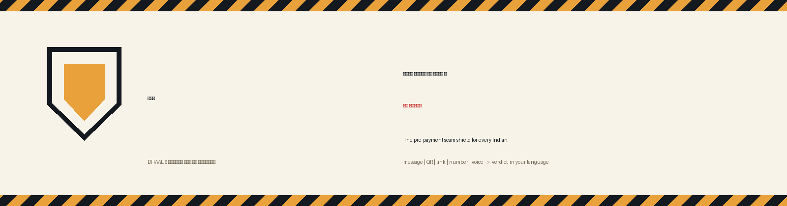
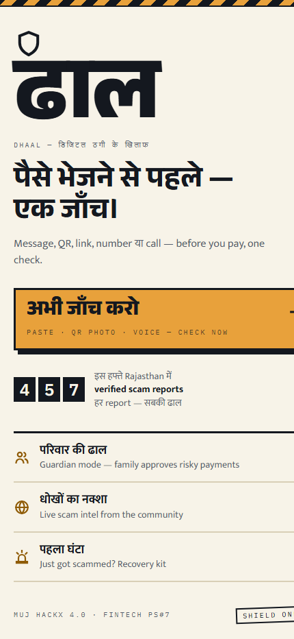
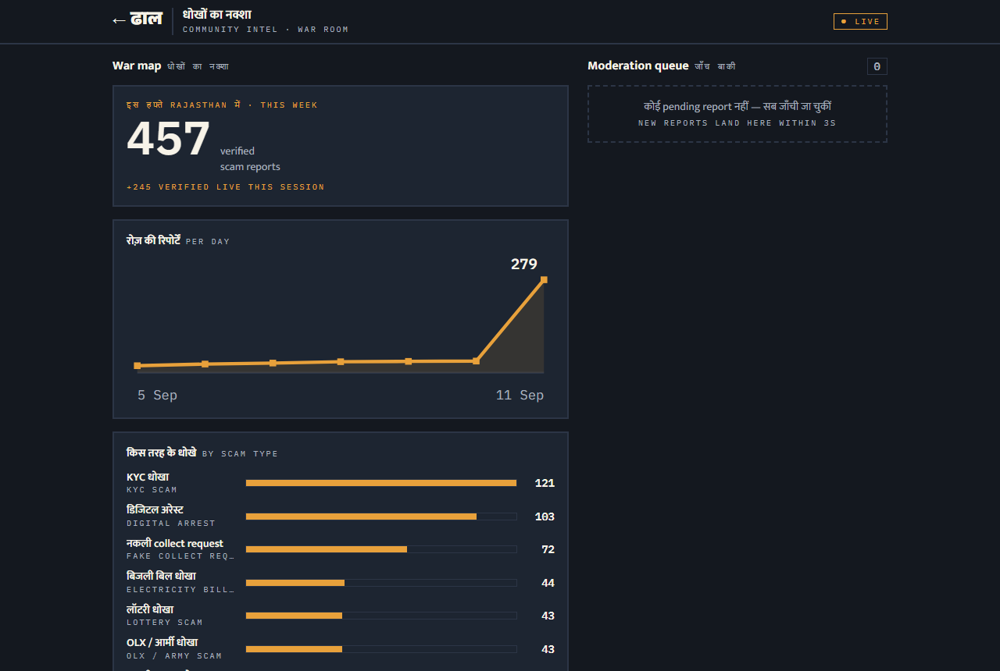
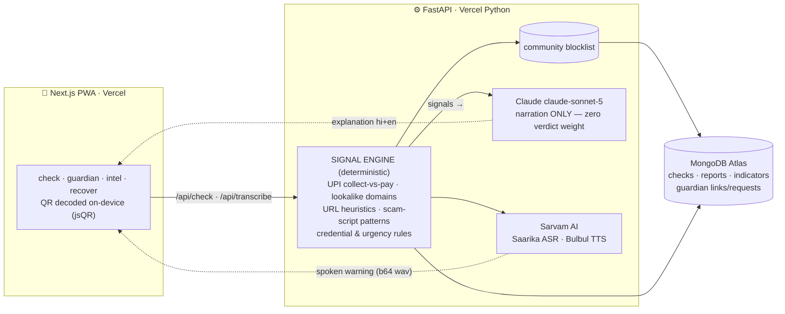

<div align="center">



# ढाल **Dhaal**

### पैसे भेजने से पहले — एक जाँच। · *Before you pay — one check.*

**The pre-payment scam shield for every Indian with a phone.**
Paste any message, link, UPI ID, or QR photo — or just **speak** — and Dhaal tells you, in your own language, exactly why it smells like fraud **before** you authorise the payment. Every confirmed report strengthens everyone else's shield.

<br/>

[**🛡️ LIVE APP**](https://dhaal-delta.vercel.app) · [**API**](https://dhaal-api.vercel.app/api/health) · [Demo run-sheet](demo/RUNSHEET.md) · [Pitch deck](pitch/) · [Verified stats](docs/STATS.md)


*Built overnight at **MUJ HackX 4.0** — Manipal University Jaipur, Sep 11–12 2026 · Fintech PS#7: Consumer Protection Against Payment Scams*

</div>

---

| The poster, not a SaaS dashboard | The war room, live from the community |
|:--:|:--:|
|  |  |

---

## Contents

[The problem](#the-problem) · [What Dhaal does](#what-dhaal-does) · [The 60-second demo](#the-60-second-demo) · [Why the verdict can be trusted](#why-the-verdict-can-be-trusted) · [Architecture](#architecture) · [The signal engine](#the-signal-engine) · [The community flywheel](#the-community-flywheel) · [Voice, both directions](#voice-both-directions) · [Measured performance](#measured-performance) · [API](#api) · [Run locally](#run-locally) · [Tests](#tests) · [Roadmap](#roadmap) · [Team](#team)

---

## The problem

India runs on UPI — **23.2 billion transactions in May 2026 alone** (NPCI). And the fastest-growing fraud doesn't hack anything: the fake KYC link, the ₹15,000 "refund" that's actually a collect request, the "digital arrest" phone call. In each one, **the victim authorises the payment themselves** — which is why bank-side fraud controls structurally cannot stop it. **₹22,000+ crore** was lost to cyber fraud in 2025; UPI fraud alone crossed **₹805 crore in FY26** across 10.64 lakh reported incidents.

The defence has to live where the decision happens: **in the user's hand, at the moment before they pay, in the language they think in.** That's Dhaal.

## What Dhaal does

| Surface | What happens |
|---|---|
| 🔍 **जाँच / Check** | Paste text, a link, a UPI ID, a number — upload a **QR photo** (decoded on-device with jsQR; the image never leaves the phone) — or press the mic and **speak**. The signal engine inspects it and returns **खतरा · सावधान · कोई ज्ञात खतरा नहीं** with every signal named, weighted, and explained in Hindi + English. Then Dhaal **speaks the warning aloud**. |
| 👨‍👩‍👧 **परिवार की ढाल / Guardian** | Pair a parent's phone with a family member's (QR or type-the-code). A risky check on the ward's phone pings the guardian for a 10-second **Allow / Block** with a note — protection without surveillance: the guardian sees the risk, never the ward's transactions. |
| 🗺️ **धोखों का नक्शा / Intel** | Anyone can report a scam. A human moderator verifies it. The number/UPI/domain instantly joins the **shared blocklist** that protects every user's next check. Live war-room board: this week's verified reports, trends by scam type, by day, by city, most-reported indicators. |
| 🚑 **पहला घंटा / Recover** | Just got scammed? The first hour decides whether money comes back (the 1930 system has recovered ₹3,400+ crore — when people report fast). Dhaal generates the **1930 call script, the cybercrime.gov.in complaint draft, and the bank dispute letter** — personalised, in Hindi, with copy buttons. |

## The 60-second demo

1. Paste the classic *"आपका SBI खाता 24 घंटे में बंद हो जाएगा… KYC करें"* SMS → 🛑 **खतरा 100/100**: lookalike domain caught, scam script matched, community count stamped on the card like a rubber seal.
2. Upload a QR screenshot → **"यह ₹15,000 का COLLECT request है — approve करते ही पैसे कटेंगे, आएँगे नहीं"** — India's most misunderstood UPI mechanic, exposed in one line.
3. Paste a **genuine** bank SMS → *कोई ज्ञात खतरा नहीं*, zero signals. Dhaal doesn't cry wolf — a legit OTP-delivery SMS scores **0**.
4. **Speak** the digital-arrest call script → danger, and Dhaal answers **in a human Hindi voice**.
5. Grandma's risky check → son's phone: **Block**. Family protecting family, live.
6. Report the scammer's number → moderator verifies → **the same number flags instantly on any other phone**. One report, everyone shielded.

## Why the verdict can be trusted

This is the architectural spine, and it's deliberate:

- **The verdict is computed, never generated.** Deterministic detectors + the community blocklist produce the signals and the score. The LLM **narrates** what was found — it carries **zero verdict weight**, cannot invent a danger, and cannot talk one away.
- **Fails safe, always.** Every external dependency (Claude, Sarvam, Atlas) auto-falls-back — template explanations, fixture transcripts, in-memory store. A dead API degrades the prose, never the protection, and never a 500.
- **Honest language.** Dhaal never says "safe" — the best it will say is *"no known risk"* — and it says so on the card.
- **Human in the loop where it matters:** community reports only enter the blocklist after moderator verification; guardian decisions are made by a person, not a model.

## Architecture



Deployment: two Vercel projects (`dhaal` frontend, `dhaal-api` Python service) + MongoDB Atlas M0. The whole stack runs free-tier.

## The signal engine

Verdict thresholds: **≥60 → खतरा danger** · **≥30 → सावधान suspicious** · else **no known risk**. Signals observed live (examples):

| Signal | Weight | What it catches |
|---|---:|---|
| `community_blocklist` | +50–65 | number/UPI/domain verified by other users' reports — shown with the live count |
| `upi_collect_request` | +45 | a COLLECT disguised as a refund — approving *sends* money |
| `lookalike_domain` | +40 | `sbi-kyc-update.xyz` imitating `sbi.co.in` (token + fuzzy match vs official-domain seed list) |
| `credential_request` | +30 | asks for OTP/PIN/CVV — **delivery-aware**: a bank's own "123456 is your OTP, do not share" scores 0 |
| `script_*` families | +25–30 | KYC-expiry, digital-arrest, lottery, electricity-cut, OLX/army advance, **job scam**, **loan-fee** — Hindi + English patterns |
| `collect_to_receive_bait` | +25 | "approve the collect request to *receive* your payment" — the OLX mechanic itself |
| `suspicious_vpa` | +20 | `refund.helpdesk@…`-style officialdom words in a UPI handle, incl. inside free text |
| `suspicious_tld` / `url_shortener` | +15–20 | throwaway scam infrastructure, hidden destinations |
| `urgency_framing` / `secrecy_pressure` / `fee_demand` | +15–25 | the psychology: rush, "tell no one", pay-to-unlock |

The seed intelligence (official bank/PSP domains, brand tokens, legit UPI suffixes, shortener + TLD lists) lives in [`backend/data/brands.py`](backend/data/brands.py). An adversarial sweep of 17 unseen inputs mid-build produced 4 misses — all four were fixed and became permanent regression cases ([docs/SWEEP-H9.md](docs/SWEEP-H9.md)).

## The community flywheel

```
one victim reports  →  human moderator verifies  →  indicator joins the blocklist
        ↑                                                      ↓
   everyone's shield gets stronger   ←   every future check, any phone, instantly
```

This is the "solve it for good" mechanism: a scam script burned in Jaipur today can't work in Jodhpur tomorrow. The blocklist is durable (Atlas), human-verified (no rumour poisoning), and visible (the war-room board shows the week's battle live).

## Voice, both directions

- **In:** press-and-hold mic → browser `MediaRecorder` webm → **Saarika ASR** (`saarika:v2.5`, auto language detection, code-mixed Hindi/English — webm accepted natively, measured ~0.6s per clip). Typed fallback always available.
- **Out:** the Hindi explanation → **Bulbul TTS** (`bulbul:v3`) → the verdict card *speaks*. For the crores of Indians who transact by voice and trust by voice, the warning arrives the same way the scam did — as a voice.

## Measured performance

Live production numbers (not lab):

| Path | Measured |
|---|---|
| Verdict (deterministic engine + Atlas) | **milliseconds** — the score is rule-based |
| Full check incl. Claude narration | **p50 5.4s** (3.7–5.8s) |
| Check + spoken warning (TTS) | ~14s end-to-end |
| Sarvam ASR per voice clip | ~0.6s |
| Typed transcribe round-trip | 0.2s |

Every external call logs a `[latency]` line; retry-once everywhere; deterministic fallback behind everything.

## API

<details>
<summary><b>Endpoints (click to expand)</b> — full contracts in <a href="docs/CONTRACTS.md">docs/CONTRACTS.md</a></summary>

| Endpoint | Purpose |
|---|---|
| `GET /api/health` | `{ok, mock_mode, store: "atlas"\|"memory"}` |
| `POST /api/check` | the core: `{type: text\|url\|upi\|qr_text\|voice_transcript, payload, lang, speak, ward_link_id}` → verdict + weighted signals + bilingual explanation (+ `tts_audio_b64` when `speak`) |
| `POST /api/transcribe` | multipart audio (webm/m4a) → Saarika ASR; or JSON `{typed_text}` fallback |
| `POST /api/guardian/links` · `GET /api/guardian/links/resolve?pair_code=` | create / join a guardian pair |
| `GET /api/guardian/requests?link_id=` · `POST …/{id}/decision` | guardian inbox · Allow/Block |
| `POST /api/reports` · `GET /api/reports?status=pending` · `POST …/{id}/verify` | report → moderate → blocklist |
| `GET /api/intel/trends` | war-room aggregates: totals, by category/day/city, top indicators |
| `POST /api/recovery/kit` | personalised 1930 script + complaint draft + bank letter |

</details>

## Run locally

```bash
# backend (FastAPI, :8000) — runs with ZERO keys: memory store + template fallbacks
cd backend && pip install -r requirements.txt && uvicorn main:app --reload
```

```bash
# frontend (Next.js, :3000)
cd frontend && npm install && cp .env.local.example .env.local && npm run dev
```

Optional `.env` at repo root unlocks the live paths: `ANTHROPIC_API_KEY` (real narration) · `SARVAM_API_KEY` (voice) · `MONGODB_URI` (durable store). Demo data: `python scripts/seed.py`.

## Tests

```bash
cd backend && python tests/run_engine_checks.py && python tests/run_api_checks.py
```

**26 engine regression checks** (every demo beat + the adversarial-sweep payloads) · **23 API contract checks** (run against memory *and* Atlas) · `tests/smoke_sarvam_live.py` — a live round trip where Dhaal speaks a warning and then transcribes its own voice.

## Roadmap

**Now (built):** the four surfaces above, live and durable. **Next:** direct share-sheet target ("share any SMS/WhatsApp message to Dhaal"), more Indic languages (Sarvam supports 11+), SDK for UPI apps to call `POST /api/check` pre-authorisation, 1930/I4C reporting API integration, state-cybercell moderation partnerships. **Model:** free for citizens forever; B2B API licensing to banks/UPI apps; deployment partnerships with state police cyber cells.

## Team

| | | Lane |
|---|---|---|
| **Saud Satopay** | [@SaudSatopay](https://github.com/SaudSatopay) | Integration · infra & deploys · QA · demo |
| **Parva Panchal** | [@parvapanchal30](https://github.com/parvapanchal30) | Product · design system · frontend · pitch |
| **Harsh Mishra** | [@harshh-2505](https://github.com/harshh-2505) | Signal engine · AI pipelines · data layer |

<div align="center">

**ढाल — हर report, सबकी सुरक्षा।**

*MUJ HackX 4.0 · Manipal University Jaipur · September 2026*

</div>
